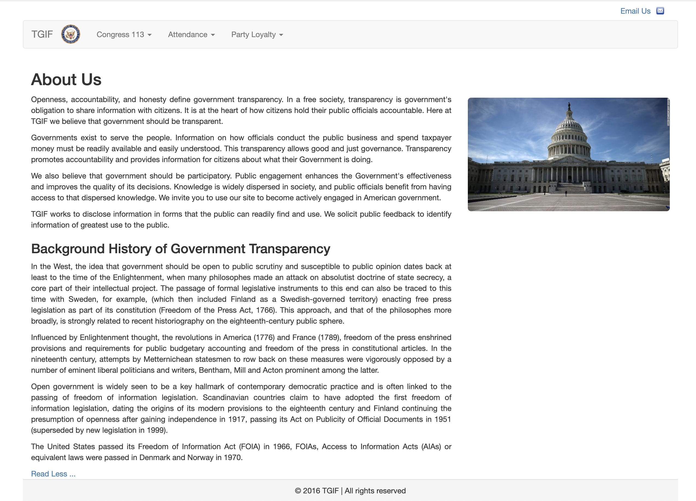
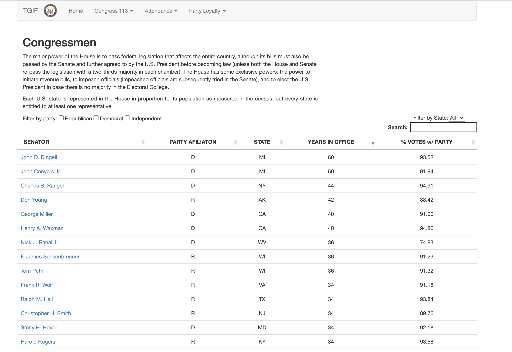
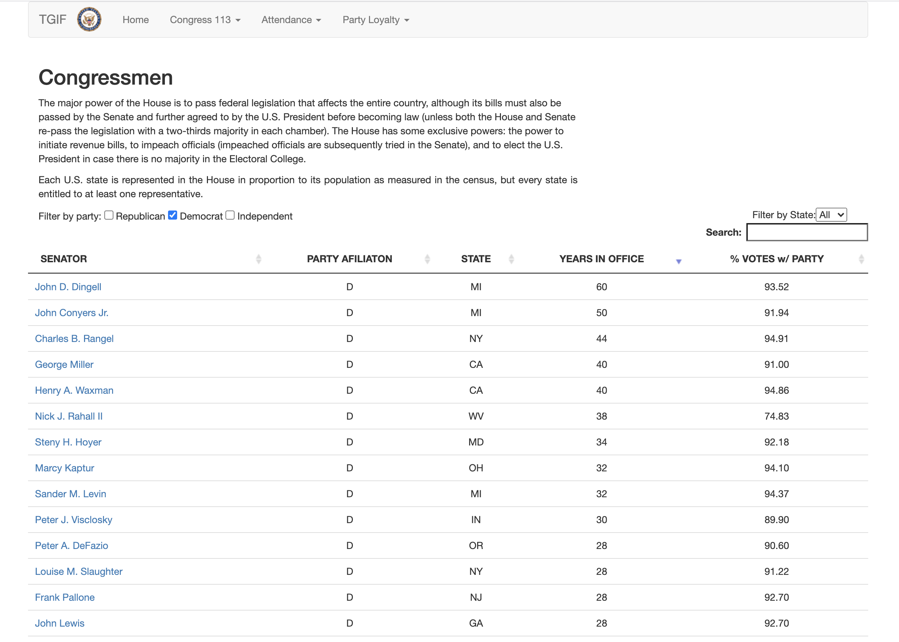
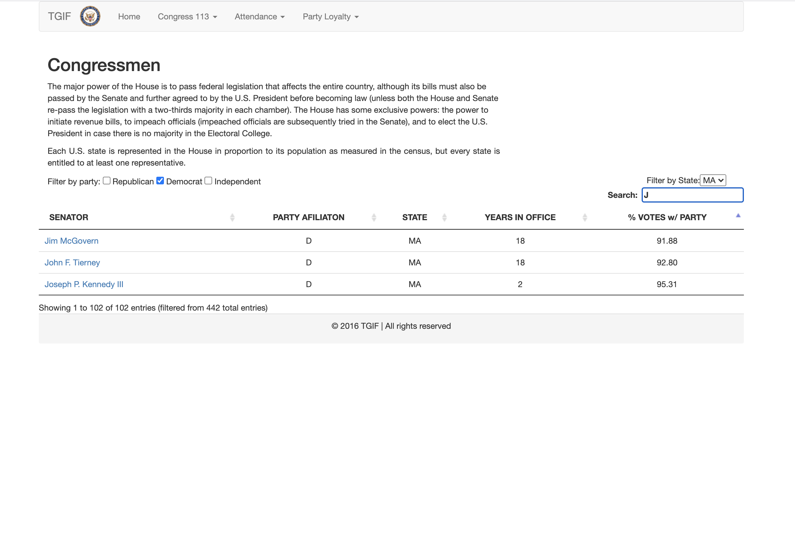
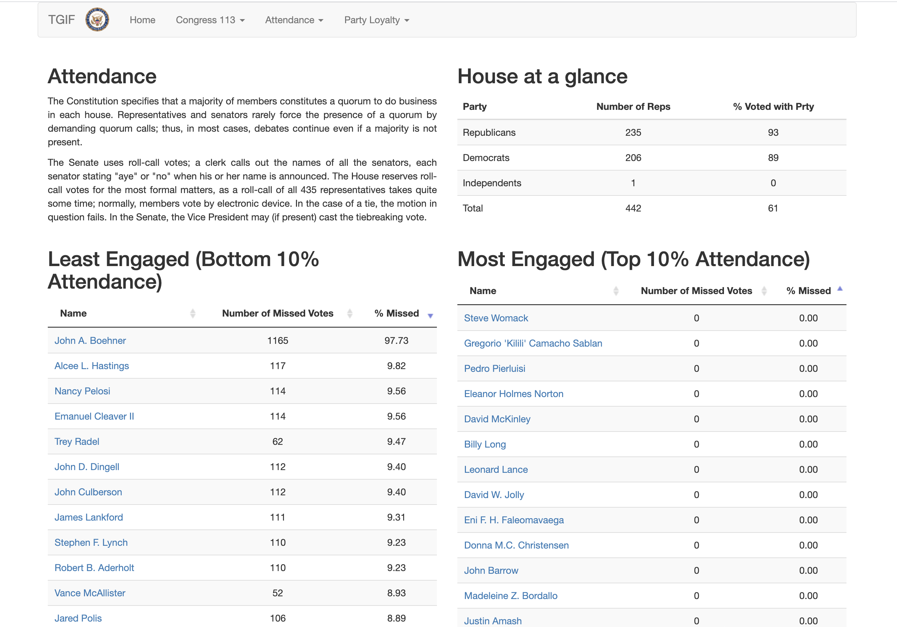

# Life_Data
Exemple of how to manage life data with AJAX calls

## Introduction
I started this project during the bootcamp.
Life_Data is governmental webpage which goal is to display House  & Senate data  in an organised way using  dashboards and tables.

## What I learned
With this project done at the very beggining of my bootcamp was I lerned how to fetch and manipulate data from an external endpoint.
Unfortunatelly the API I used is not anymore available.

## Features
* Collapsable static content
* Fetch and update livedata
* Multiple and independent filter selection
* Easy access to candidates page

## Stack - Technologies
* [Bootstrap 3](https://getbootstrap.com/docs/3.3/)
* [Mustache 2](https://github.com/mustache/mustache.github.com)
* [jQuery 3](https://jquery.com/)

## Gallery

  
  
  
  
  
  

